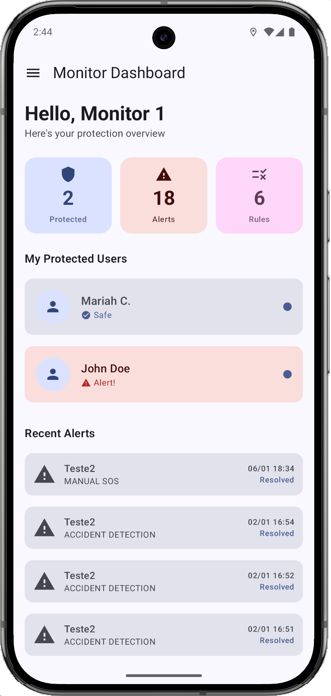
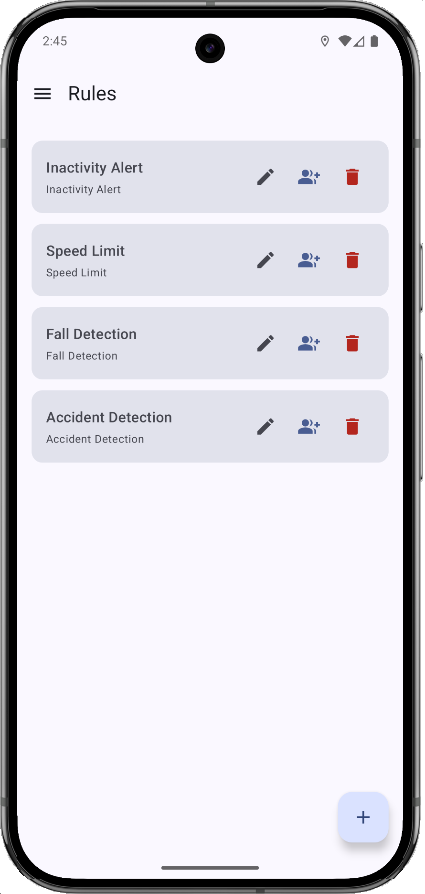
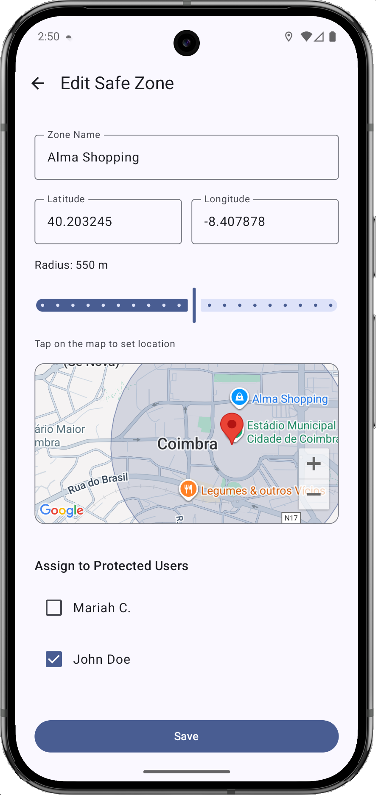
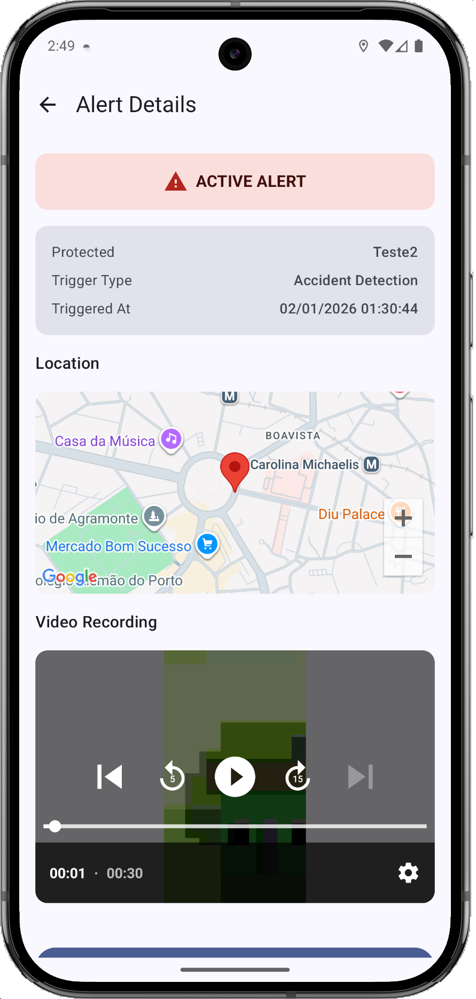
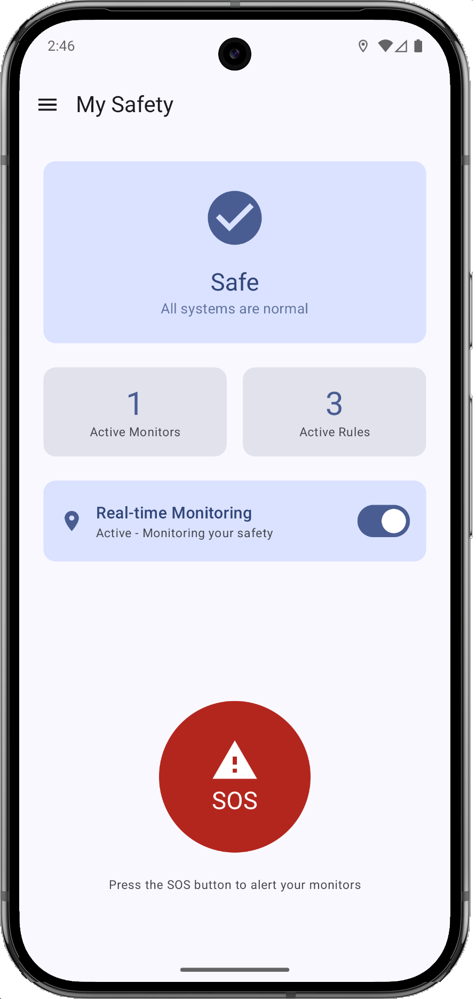
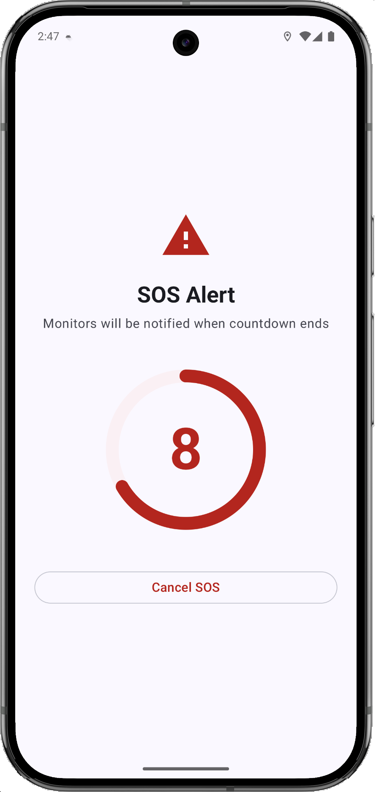
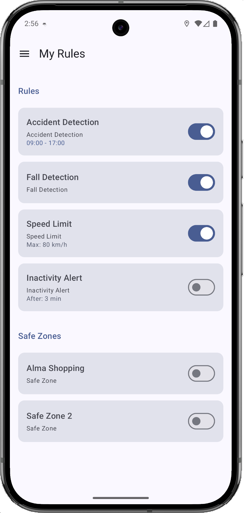
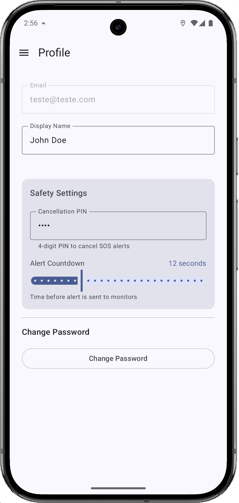

# 🛡️ SafetYSec

[](README.md)
[](README.pt.md)

> **Real-time safety monitoring app** for Android that allows monitors to track and protect vulnerable individuals through GPS tracking, fall detection, speed alerts, and emergency SOS features.


---

## 📖 About

SafetYSec is a comprehensive safety monitoring application designed for scenarios where caregivers (monitors) need to keep track of vulnerable individuals (protected users) such as elderly family members, children, or people with special needs.

The app enables real-time monitoring with customizable safety rules, automatic alert detection, and emergency response features.

---

## ✨ Features

### 👥 Two User Roles
- **Monitor**: Creates safety rules, monitors protected users, receives alerts
- **Protected User**: Accepts rules, triggers SOS, cancels false alarms

### 🔐 Authentication
- Email/Password registration and login
- Google Sign-In integration
- Password reset via email

### 📍 Real-Time Monitoring
- GPS location tracking with altitude
- Background monitoring via Foreground Service
- Configurable monitoring schedules

### ⚠️ Safety Rules & Alerts
| Rule Type | Description |
|-----------|-------------|
| 🚶 **Fall Detection** | Detects falls via accelerometer (G-Force > 2.5) |
| 🚗 **Speed Limit** | Alerts when exceeding configured speed |
| 📍 **Geofence** | Alerts when leaving safe zones (Haversine formula) |
| ⏰ **Inactivity** | Alerts after prolonged inactivity |
| 💥 **Accident Detection** | Detects severe impacts (G-Force > 4.0) |

### 🆘 Emergency Features
- **SOS Button**: Manual emergency trigger
- **Countdown Timer**: Configurable cancellation window (PIN protected)
- **Video Recording**: 30-second video capture after alerts
- **Full-Screen Notifications**: Works even on lock screen

### 🔗 Monitor-Protected Association
- OTP-based pairing system (6-digit code)
- Multiple monitors per protected user
- Rule acceptance/rejection by protected users

---

## 📱 Screenshots

### Monitor Dashboard
<p align="center">
  
  
  
  
</p>

### Protected User
<p align="center">
  
  
  
  
</p>

---

## 🏗️ Architecture

```
┌─────────────────────────────────────────────────────────────┐
│                         UI Layer                            │
│  ┌─────────────┐  ┌─────────────┐  ┌─────────────────────┐  │
│  │   Screens   │  │ Components  │  │    Navigation       │  │
│  │  (Compose)  │  │  (Drawer)   │  │  (NavHost/Routes)   │  │
│  └─────────────┘  └─────────────┘  └─────────────────────┘  │
├─────────────────────────────────────────────────────────────┤
│                      ViewModel Layer                        │
│  ┌───────────────────────────────────────────────────────┐  │
│  │  AuthViewModel (State + LiveData)                     │  │
│  └───────────────────────────────────────────────────────┘  │
├─────────────────────────────────────────────────────────────┤
│                     Repository Layer                        │
│  ┌───────────┐ ┌───────────┐ ┌───────────┐ ┌─────────────┐  │
│  │   Auth    │ │   User    │ │   Rules   │ │   Alerts    │  │
│  │Repository │ │Repository │ │Repository │ │ Repository  │  │
│  └───────────┘ └───────────┘ └───────────┘ └─────────────┘  │
├─────────────────────────────────────────────────────────────┤
│                      Service Layer                          │
│  ┌───────────────────────────────────────────────────────┐  │
│  │  BackgroundLocationService (Foreground Service)       │  │
│  │  GPS + Accelerometer + Rule Checking + Alerts         │  │
│  └───────────────────────────────────────────────────────┘  │
├─────────────────────────────────────────────────────────────┤
│                       Data Layer                            │
│  ┌───────────────────┐  ┌────────────────────────────────┐  │
│  │  Firebase Auth    │  │  Firestore (NoSQL Database)    │  │
│  └───────────────────┘  └────────────────────────────────┘  │
│  ┌───────────────────────────────────────────────────────┐  │
│  │              Firebase Storage (Videos)                │  │
│  └───────────────────────────────────────────────────────┘  │
└─────────────────────────────────────────────────────────────┘
```

---

## 🛠️ Tech Stack

| Category | Technology |
|----------|------------|
| **Language** | Kotlin |
| **UI Framework** | Jetpack Compose |
| **Architecture** | MVVM + Repository Pattern |
| **Backend** | Firebase (Auth, Firestore, Storage) |
| **Location** | Google Play Services (FusedLocationProviderClient) |
| **Camera** | CameraX |
| **Video Player** | Media3 ExoPlayer |
| **Maps** | Google Maps SDK |
| **Navigation** | Navigation Compose |

---

## 📂 Project Structure

```
app/src/main/java/pt/isec/diogo/safetysec/
├── MainActivity.kt              # Entry point + NavHost
├── SafetYSecApp.kt              # Application class (DI)
├── data/
│   ├── model/                   # Data classes
│   │   ├── User.kt
│   │   ├── Alert.kt
│   │   ├── Rule.kt
│   │   ├── RuleAssignment.kt
│   │   ├── Association.kt
│   │   └── OtpCode.kt
│   └── repository/              # Firebase access
│       ├── AuthRepository.kt
│       ├── UserRepository.kt
│       ├── RulesRepository.kt
│       ├── AlertsRepository.kt
│       └── AssociationRepository.kt
├── services/
│   └── BackgroundLocationService.kt  # Foreground service
├── ui/
│   ├── components/              # Reusable UI
│   │   ├── DrawerScaffold.kt
│   │   └── AppDrawer.kt
│   ├── navigation/              # Route definitions
│   │   ├── Screen.kt
│   │   ├── MonitorScreen.kt
│   │   └── ProtectedScreen.kt
│   ├── screens/
│   │   ├── common/              # Login, Register
│   │   ├── monitor/             # 13 screens
│   │   └── protected_user/      # 10 screens
│   ├── theme/                   # Material 3 theme
│   └── viewmodels/
│       └── AuthViewModel.kt
└── utils/
    ├── GeofenceChecker.kt       # Haversine distance
    ├── LocationHandler.kt
    └── VideoRecorder.kt         # CameraX wrapper
```

---

## 🚀 Getting Started

### Prerequisites
- Android Studio Hedgehog (2023.1.1) or later
- Android SDK 34
- Google Play Services
- Firebase project

### Setup

1. **Clone the repository**
   ```bash
   git clone https://github.com/yourusername/SafetYSec.git
   cd SafetYSec
   ```

2. **Firebase Configuration**
   - Create a Firebase project at [console.firebase.google.com](https://console.firebase.google.com)
   - Enable Authentication (Email/Password + Google)
   - Enable Firestore Database
   - Enable Storage
   - Download `google-services.json` and place in `app/`

3. **Google Maps API Key**
   - Get an API key from [Google Cloud Console](https://console.cloud.google.com)
   - Create `secrets.properties` in project root:
     ```properties
     MAPS_API_KEY=your_api_key_here
     ```

4. **Build and Run**
   ```bash
   ./gradlew assembleDebug
   ```

---

## 🌍 Localization

The app supports:
- 🇬🇧 English (default)
- 🇵🇹 Portuguese (Portugal)

All strings are externalized in `res/values/strings.xml` and `res/values-pt-rPT/strings.xml`.

---

## 📄 License

This project was developed as part of the **Mobile Architectures** course at [ISEC - Instituto Superior de Engenharia de Coimbra](https://www.isec.pt).

---

## 👨‍💻 Author

**Diogo Luz**  
Computer Engineering Student @ ISEC  
2025/2026

---

<p align="center">
  <i>Built with ❤️ using Kotlin and Jetpack Compose</i>
</p>
