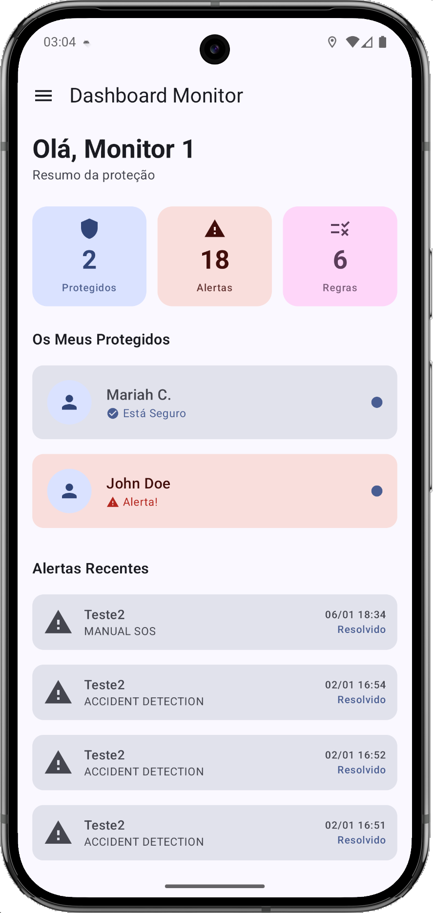
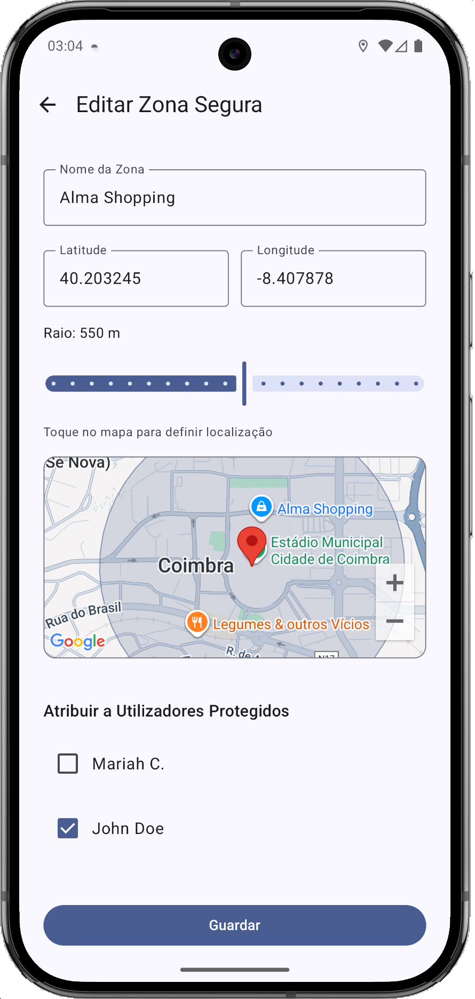
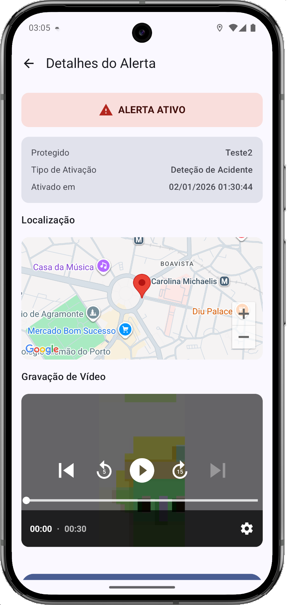
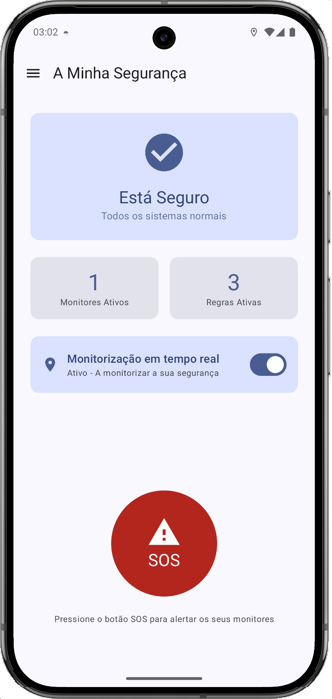
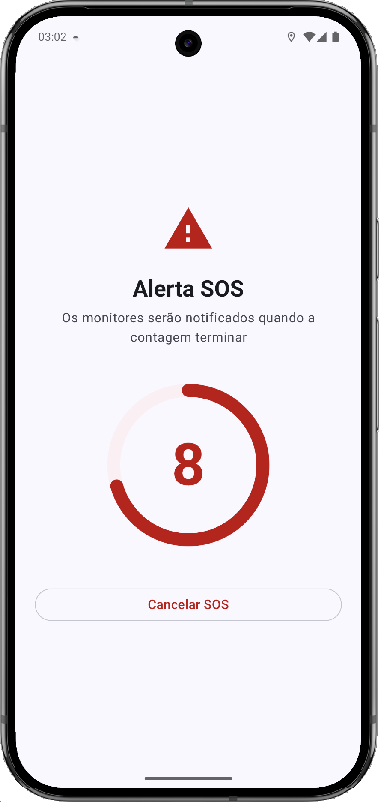
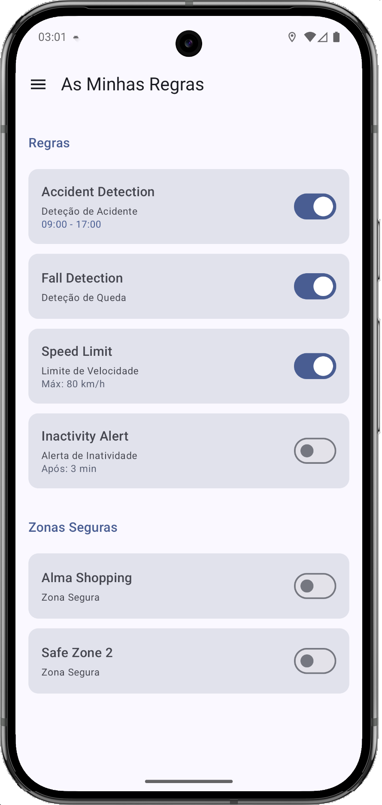
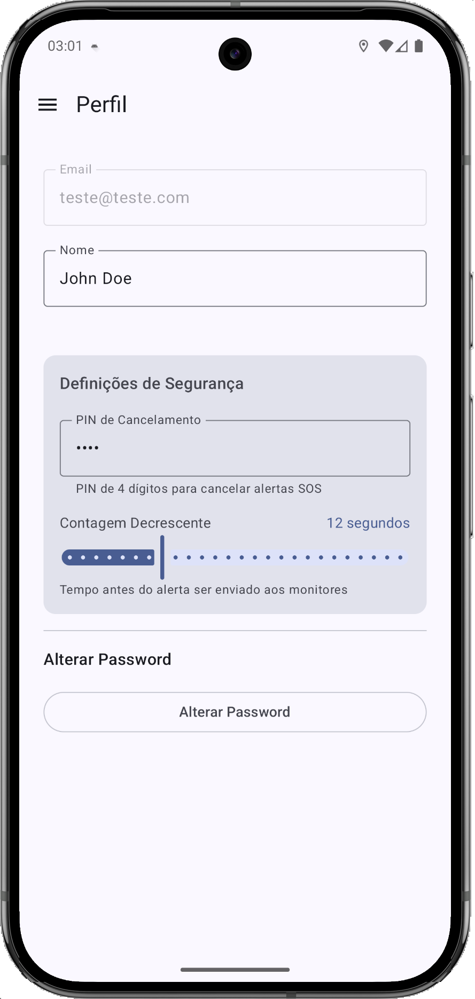

# 🛡️ SafetYSec

[](README.md)
[](README.pt.md)

> **Aplicação de monitorização de segurança em tempo real** para Android que permite a monitores acompanhar e proteger indivíduos vulneráveis através de rastreamento GPS, deteção de quedas, alertas de velocidade e funcionalidades SOS de emergência.


---

## 📖 Sobre

O SafetYSec é uma aplicação abrangente de monitorização de segurança concebida para cenários em que cuidadores (monitores) precisam de acompanhar indivíduos vulneráveis (utilizadores protegidos), como familiares idosos, crianças ou pessoas com necessidades especiais.

A aplicação permite monitorização em tempo real com regras de segurança personalizáveis, deteção automática de alertas e funcionalidades de resposta a emergências.

---

## ✨ Funcionalidades

### 👥 Dois Perfis de Utilizador
- **Monitor**: Cria regras de segurança, monitoriza utilizadores protegidos, recebe alertas
- **Utilizador Protegido**: Aceita regras, aciona SOS, cancela falsos alarmes

### 🔐 Autenticação
- Registo e login com email/password
- Integração com Google Sign-In
- Recuperação de password por email

### 📍 Monitorização em Tempo Real
- Rastreamento de localização GPS com altitude
- Monitorização em segundo plano via Foreground Service
- Horários de monitorização configuráveis

### ⚠️ Regras de Segurança e Alertas
| Tipo de Regra | Descrição |
|---------------|-----------|
| 🚶 **Deteção de Queda** | Deteta quedas via acelerómetro (G-Force > 2.5) |
| 🚗 **Limite de Velocidade** | Alerta quando excede velocidade configurada |
| 📍 **Geofence** | Alerta ao sair de zonas seguras (fórmula de Haversine) |
| ⏰ **Inatividade** | Alerta após inatividade prolongada |
| 💥 **Deteção de Acidente** | Deteta impactos severos (G-Force > 4.0) |

### 🆘 Funcionalidades de Emergência
- **Botão SOS**: Acionamento manual de emergência
- **Temporizador com Countdown**: Janela de cancelamento configurável (protegida por PIN)
- **Gravação de Vídeo**: Captura de vídeo de 30 segundos após alertas
- **Notificações Full-Screen**: Funciona mesmo com ecrã bloqueado

### 🔗 Associação Monitor-Protegido
- Sistema de emparelhamento por OTP (código de 6 dígitos)
- Múltiplos monitores por utilizador protegido
- Aceitação/rejeição de regras pelo utilizador protegido

---

## 📱 Screenshots

### Dashboard Monitor
<p align="center">
  
  
  
  
</p>

### Utilizador Protegido
<p align="center">
  
  
  
  
</p>

---

## 🏗️ Arquitetura

```
┌─────────────────────────────────────────────────────────────┐
│                        Camada UI                            │
│  ┌─────────────┐  ┌─────────────┐  ┌─────────────────────┐  │
│  │   Ecrãs     │  │ Componentes │  │     Navegação       │  │
│  │  (Compose)  │  │  (Drawer)   │  │  (NavHost/Rotas)    │  │
│  └─────────────┘  └─────────────┘  └─────────────────────┘  │
├─────────────────────────────────────────────────────────────┤
│                     Camada ViewModel                        │
│  ┌───────────────────────────────────────────────────────┐  │
│  │  AuthViewModel (Estado + LiveData)                    │  │
│  └───────────────────────────────────────────────────────┘  │
├─────────────────────────────────────────────────────────────┤
│                    Camada Repository                        │
│  ┌───────────┐ ┌───────────┐ ┌───────────┐ ┌─────────────┐  │
│  │   Auth    │ │   User    │ │   Rules   │ │   Alerts    │  │
│  │Repository │ │Repository │ │Repository │ │ Repository  │  │
│  └───────────┘ └───────────┘ └───────────┘ └─────────────┘  │
├─────────────────────────────────────────────────────────────┤
│                      Camada Service                         │
│  ┌───────────────────────────────────────────────────────┐  │
│  │  BackgroundLocationService (Foreground Service)       │  │
│  │  GPS + Acelerómetro + Verificação de Regras + Alertas │  │
│  └───────────────────────────────────────────────────────┘  │
├─────────────────────────────────────────────────────────────┤
│                       Camada Data                           │
│  ┌───────────────────┐  ┌────────────────────────────────┐  │
│  │  Firebase Auth    │  │  Firestore (Base de Dados)     │  │
│  └───────────────────┘  └────────────────────────────────┘  │
│  ┌───────────────────────────────────────────────────────┐  │
│  │            Firebase Storage (Vídeos)                  │  │
│  └───────────────────────────────────────────────────────┘  │
└─────────────────────────────────────────────────────────────┘
```

---

## 🛠️ Stack Tecnológica

| Categoria | Tecnologia |
|-----------|------------|
| **Linguagem** | Kotlin |
| **Framework UI** | Jetpack Compose |
| **Arquitetura** | MVVM + Repository Pattern |
| **Backend** | Firebase (Auth, Firestore, Storage) |
| **Localização** | Google Play Services (FusedLocationProviderClient) |
| **Câmara** | CameraX |
| **Reprodutor de Vídeo** | Media3 ExoPlayer |
| **Mapas** | Google Maps SDK |
| **Navegação** | Navigation Compose |

---

## 📂 Estrutura do Projeto

```
app/src/main/java/pt/isec/diogo/safetysec/
├── MainActivity.kt              # Ponto de entrada + NavHost
├── SafetYSecApp.kt              # Classe Application (DI)
├── data/
│   ├── model/                   # Data classes
│   │   ├── User.kt
│   │   ├── Alert.kt
│   │   ├── Rule.kt
│   │   ├── RuleAssignment.kt
│   │   ├── Association.kt
│   │   └── OtpCode.kt
│   └── repository/              # Acesso Firebase
│       ├── AuthRepository.kt
│       ├── UserRepository.kt
│       ├── RulesRepository.kt
│       ├── AlertsRepository.kt
│       └── AssociationRepository.kt
├── services/
│   └── BackgroundLocationService.kt  # Foreground service
├── ui/
│   ├── components/              # UI reutilizável
│   │   ├── DrawerScaffold.kt
│   │   └── AppDrawer.kt
│   ├── navigation/              # Definição de rotas
│   │   ├── Screen.kt
│   │   ├── MonitorScreen.kt
│   │   └── ProtectedScreen.kt
│   ├── screens/
│   │   ├── common/              # Login, Registo
│   │   ├── monitor/             # 13 ecrãs
│   │   └── protected_user/      # 10 ecrãs
│   ├── theme/                   # Tema Material 3
│   └── viewmodels/
│       └── AuthViewModel.kt
└── utils/
    ├── GeofenceChecker.kt       # Distância Haversine
    ├── LocationHandler.kt
    └── VideoRecorder.kt         # Wrapper CameraX
```

---

## 🚀 Como Começar

### Pré-requisitos
- Android Studio Hedgehog (2023.1.1) ou superior
- Android SDK 34
- Google Play Services
- Projeto Firebase

### Configuração

1. **Clonar o repositório**
   ```bash
   git clone https://github.com/yourusername/SafetYSec.git
   cd SafetYSec
   ```

2. **Configuração Firebase**
   - Criar um projeto Firebase em [console.firebase.google.com](https://console.firebase.google.com)
   - Ativar Authentication (Email/Password + Google)
   - Ativar Firestore Database
   - Ativar Storage
   - Descarregar `google-services.json` e colocar em `app/`

3. **Chave API Google Maps**
   - Obter uma chave API em [Google Cloud Console](https://console.cloud.google.com)
   - Criar `secrets.properties` na raiz do projeto:
     ```properties
     MAPS_API_KEY=a_tua_chave_api_aqui
     ```

4. **Compilar e Executar**
   ```bash
   ./gradlew assembleDebug
   ```

---

## 🌍 Localização

A aplicação suporta:
- 🇬🇧 Inglês (predefinido)
- 🇵🇹 Português (Portugal)

Todas as strings estão externalizadas em `res/values/strings.xml` e `res/values-pt-rPT/strings.xml`.

---

## 📄 Licença

Este projeto foi desenvolvido no âmbito da unidade curricular **Arquiteturas Móveis** no [ISEC - Instituto Superior de Engenharia de Coimbra](https://www.isec.pt).

---

## 👨‍💻 Autor

**Diogo Luz**  
Estudante de Engenharia Informática @ ISEC  
2025/2026

---

<p align="center">
  <i>Desenvolvido com ❤️ usando Kotlin e Jetpack Compose</i>
</p>
